# Reinforcement Learning — how it works

This document covers all of the reinforcement learning (RL) in this project: where each piece lives,
which RL method is used, and how data moves from a ship in the Unity game to the neural network and
back.

- **How it works** — this page.
- **How to run it** (build, train, evaluate, watch) and **results so far** —
  [Training/README.md](Training/README.md).

> Diagrams use [Mermaid](https://mermaid.js.org/). They render on GitHub and in VS Code (with a
> Mermaid preview extension).

---

## Contents

1. [The short version](#1-the-short-version)
2. [Where everything is](#2-where-everything-is)
3. [The RL method](#3-the-rl-method)
4. [One training step, end to end](#4-one-training-step-end-to-end)
5. [The Unity environment](#5-the-unity-environment)
6. [Observations — what a ship sees](#6-observations--what-a-ship-sees)
7. [Actions — what a ship can do](#7-actions--what-a-ship-can-do)
8. [Rewards](#8-rewards)
9. [The neural networks](#9-the-neural-networks)
10. [The MAPPO training algorithm](#10-the-mappo-training-algorithm)
11. [Curriculum and self-play league](#11-curriculum-and-self-play-league)
12. [Behaviour cloning warm start](#12-behaviour-cloning-warm-start)
13. [Export and in-game inference](#13-export-and-in-game-inference)
14. [Ablation switches](#14-ablation-switches)
15. [Extending the system](#15-extending-the-system)
16. [Glossary](#16-glossary)

---

## 1. The short version

- **Method:** recurrent **MAPPO** (Multi-Agent Proximal Policy Optimisation). It uses *centralised
  training with decentralised execution*: every ship runs the **same actor network**, which only sees
  what that ship legally knows under fog of war. A **centralised critic** that also sees the true
  enemy state is used during training only.
- **Warm start:** the actor first learns to **imitate the rule-based AI** (behaviour cloning), then
  MAPPO fine-tunes it.
- **Any map:** nothing in the observation names a map. Each ship senses terrain with **16 egocentric
  rays** (open water for its draft, distance to land that hides it) and sees the nearest **islands,
  rocks and smoke screens as tokens**, and the full-game stages draw a **random battlefield** every few
  battles. The same network plays an archipelago, open sea, a strait or a hand-built scenario.
- **Every ability:** each consumable's charges, cooldown and time left are observed; allies' radar,
  hydro, repair and smoke are visible; the critic sees the enemy's too.
- **Opponents:** a **curriculum** of battles, from a 1v1 battleship duel up to the full 6v6+ game,
  against the rule AI at rising difficulty. After that comes a **self-play league**: the current
  policy, frozen past snapshots chosen by prioritised fictitious self-play, and the rule AI kept as
  an anchor.
- **Split:** Unity is the *environment* (C#, [Assets/Scripts/RL/](Assets/Scripts/RL/)). Python is
  the *trainer* (PyTorch, [Training/](Training/)). They talk over a lockstep TCP protocol, with one
  headless Unity process per parallel battle.
- **Shipping:** the trained actor is exported to
  [Assets/StreamingAssets/RL/naval_policy.bin](Assets/StreamingAssets/RL/) and run by a
  dependency-free C# re-implementation of the network inside the game. Neither ML-Agents nor ONNX is
  used.

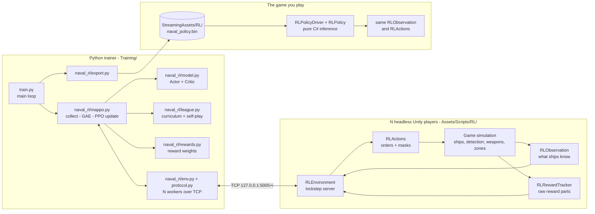

---

## 2. Where everything is

### 2.1 Folder map

```text
WOW-Simulation/
├── RL_README.md                         <- this file
├── Assets/
│   ├── Scripts/RL/                      <- Unity side of RL (namespace Naval.RL)
│   │   ├── RLEnvironment.cs             training server: lockstep loop, reset, step, observation message
│   │   ├── RLWire.cs                    TCP framing (JSON header + raw float/int arrays)
│   │   ├── RLLayout.cs                  every size, feature name and action head; the "spec" message
│   │   ├── RLObservation.cs             builds actor (fog-legal) and critic (privileged) observations
│   │   ├── RLActions.cs                 action masks + turning chosen actions into ship orders
│   │   ├── RLRewardTracker.cs           raw reward components per team / per ship
│   │   ├── RLMetrics.cs                 behaviour metrics per battle (focus fire, radar use, ...)
│   │   ├── RLExpertLabels.cs            labels rule-AI decisions as policy actions (behaviour cloning)
│   │   ├── RLPolicy.cs                  the neural network, re-implemented in plain C#
│   │   ├── RLPolicyDriver.cs            flies "Learned" ships in normal play using RLPolicy
│   │   ├── RLDemo.cs                    -rlDemo command line: jump straight into a policy battle
│   │   └── RLCommandLine.cs             -rlTrain / -rlPort / -rlDemo argument parsing
│   ├── Editor/RLBuild.cs                menu "Naval > RL > Build Training Player (Linux)"
│   └── StreamingAssets/RL/naval_policy.bin   the exported policy the game loads
└── Training/                            <- Python side of RL
    ├── train.py                         MAPPO training entry point
    ├── bc.py                            behaviour cloning: collect demos / train on them
    ├── evaluate.py                      win rate vs the rule AI (also random / scripted baselines)
    ├── watch.py                         film one battle of a checkpoint (mp4 + gif)
    ├── watch_checkpoints.py             auto-evaluate every checkpoint of a running run
    ├── probe_actions.py                 sanity-check each order type in the real game
    ├── build_player.sh                  build the headless Linux player from a synced project copy
    ├── check_paths.sh                   smoke-test every stage and ablation against the real game
    ├── pipeline_bc_mappo.sh             collect -> BC -> evaluate -> install -> MAPPO -> auto-eval
    ├── share_checkpoint.py              publish a run's checkpoint to checkpoints/ for the team / list them
    ├── requirements.txt                 torch, numpy (tensorboard / pyyaml optional)
    ├── naval_rl/
    │   ├── config.py                    every hyperparameter + the curriculum stage list
    │   ├── spec.py                      parses the environment's "spec" (sizes, heads)
    │   ├── protocol.py                  Python half of the wire protocol
    │   ├── env.py                       launches / connects Unity workers, async step
    │   ├── mock_env.py                  fake environment to test the trainer without Unity
    │   ├── model.py                     Actor, Critic, LocalCritic, masked distributions, ValueNorm
    │   ├── mappo.py                     rollout collection, GAE, PPO update
    │   ├── rewards.py                   reward weights + shaping annealing
    │   ├── league.py                    curriculum promotion, self-play opponent sampling (PFSP)
    │   ├── export.py                    writes naval_policy.bin + parity test cases
    │   └── share.py                     shared checkpoints: publish, relocate snapshots, overwrite guard
    ├── scenarios/                       stage 0-2 battles (Scenario editor JSON format)
    ├── tests/                           pytest suite + tests/parity (C# vs PyTorch check)
    ├── checkpoints/                     checkpoints shared with the team through git
    └── runs/                            outputs of every training / eval run (not in git)
```

### 2.2 Unity RL files

| File | What it does | Key members |
|---|---|---|
| [RLEnvironment.cs](Assets/Scripts/RL/RLEnvironment.cs) | One training environment per Unity process. Listens on TCP, runs the `init / reset / step / render / close` state machine, advances exactly `decision_period / sim_dt` frames per step, assembles the observation message. | `Init` [:291](Assets/Scripts/RL/RLEnvironment.cs:291), `Reset` [:325](Assets/Scripts/RL/RLEnvironment.cs:325), `StartEpisode` [:379](Assets/Scripts/RL/RLEnvironment.cs:379), `Step` [:427](Assets/Scripts/RL/RLEnvironment.cs:427), `SendObservation` [:521](Assets/Scripts/RL/RLEnvironment.cs:521) |
| [RLWire.cs](Assets/Scripts/RL/RLWire.cs) | Length-prefixed frames of a JSON header followed by raw little-endian arrays. | `Receive`, `Begin`, `AddArray`, `AddArrayPair`, `Send` |
| [RLLayout.cs](Assets/Scripts/RL/RLLayout.cs) | The single source of truth for padding caps, feature names, dimensions and action heads. `SpecJson` sends all of it to Python. | `ShipStateFeatures`, `ContactFeatures`, `HeadSize`, `HeadOffset`, `SpecJson` |
| [RLObservation.cs](Assets/Scripts/RL/RLObservation.cs) | Fills a `TeamObs` for one team: actor tokens (fog-of-war legal) and critic tokens (ground truth plus belief). Also casts the terrain rays, gathers island / smoke obstacles and finds each ship's cover point. | `Build` [:160](Assets/Scripts/RL/RLObservation.cs:160), `WriteShipState`, `WriteTerrainRays`, `WriteObstacles`, `FindCover`, `WriteCriticEnemy` |
| [RLActions.cs](Assets/Scripts/RL/RLActions.cs) | Builds the per-ship **action mask** and **applies** a chosen action through the ship's existing autopilot, gunnery and ability systems. | `WriteMask` [:41](Assets/Scripts/RL/RLActions.cs:41), `Apply` [:205](Assets/Scripts/RL/RLActions.cs:205), `AbilityUsable` |
| [RLRewardTracker.cs](Assets/Scripts/RL/RLRewardTracker.cs) | Subscribes to damage and kill events and accumulates raw reward components between decisions. | `TeamComponents`, `AgentComponents`, `OnDamaged`, `EndStep` |
| [RLMetrics.cs](Assets/Scripts/RL/RLMetrics.cs) | Behaviour statistics for both fleets per battle: DD concealment, radar-on-DD, focus fire, hold-fire share, first capture time, spotting share, friendly fire. | `Sample`, `AppendJson` |
| [RLExpertLabels.cs](Assets/Scripts/RL/RLExpertLabels.cs) | Watches a rule-AI ship between two decisions and says which of the policy's actions best describes what it did. These labels are the behaviour cloning targets. | `Remember`, `Label`, `MoveOption` |
| [RLPolicy.cs](Assets/Scripts/RL/RLPolicy.cs) | Loads `naval_policy.bin` and runs the actor (and optionally the critic) forward pass in plain C#, operation for operation the same as PyTorch. It has no UnityEngine dependency, so it can be tested outside Unity. | `Load`, `Act`, `Evaluate`, `MiniJson` |
| [RLPolicyDriver.cs](Assets/Scripts/RL/RLPolicyDriver.cs) | In normal play, commands every ship whose `Controller == Learned`: observe once per decision period, then spread forward passes over frames. | `TryLoad`, `Tick`, `Observe`, `Decide`, `Choose` |
| [RLDemo.cs](Assets/Scripts/RL/RLDemo.cs) | `-rlDemo both\|enemy\|player` skips the menu and starts a 6v6 domination battle flown by the policy. | `Create`, `Start` |
| [RLCommandLine.cs](Assets/Scripts/RL/RLCommandLine.cs) | Parses `-rlTrain`, `-rlPort N`, `-rlDemo`, `-rlDemoShips`, `-rlDemoSeconds`. | `Has`, `Str`, `Int` |
| [Editor/RLBuild.cs](Assets/Editor/RLBuild.cs) | Builds `Builds/NavalTrainer/NavalTrainer.x86_64` (menu item or `-executeMethod`). | `BuildLinuxTrainer` |

### 2.3 Game code that RL hooks into

RL needed a few changes in the core game. These are the places:

| Where | What it adds for RL |
|---|---|
| [NavalTypes.cs:32](Assets/Scripts/Core/NavalTypes.cs:32) | `enum ShipController { Human, RuleAI, Learned }`. Any fleet can be flown by any of the three. |
| [Ship.cs:43](Assets/Scripts/Ships/Ship.cs:43) | `Controller`, `ExternalHelm` (low-level rudder/throttle mode), `LearnedMove` (used by the "keep" action), `LearnedAmmoSwitchTime` (shell-switch cooldown). |
| [ShipAI.cs:92](Assets/Scripts/AI/ShipAI.cs:92) | When a ship is `Learned`, the rule AI stops choosing targets, movement and consumables. Only the *reflexes* stay on: torpedo evasion (`AutoEvade`) and automatic damage control (`AutoDamageControl`). |
| [GameManager.cs:457](Assets/Scripts/Core/GameManager.cs:457) | `SetTeamController` hands a fleet to a controller and switches the fleet commander's strategic control off for non-rule fleets. `BeginTrainingMatch` and `OverrideTimeLimit` let the trainer build battles directly. |
| [GameBootstrap.cs:35](Assets/Scripts/Core/GameBootstrap.cs:35) | `rlTrainingServer` checkbox / `-rlTrain` flag, `rlPort` / `-rlPort`. Always creates `RLPolicyDriver`. In training mode it creates `RLEnvironment` instead of showing the menu. |
| [GameEvents.cs:12](Assets/Scripts/Core/GameEvents.cs:12) | `OnShipDamaged(victim, amount, attacker)` now carries the attacker, so damage can be credited to a ship. |
| [DetectionSystem.cs:22](Assets/Scripts/Detection/DetectionSystem.cs:22) | `Contact.spotter` records which ship produced a contact, so **spotting damage** can be rewarded. |
| [UIManager.cs:755](Assets/Scripts/UI/UIManager.cs:755) | Setup screen: *Enemy AI: Rule-based / Learned* and *Your fleet: You command / Learned*. The Learned buttons only work when a policy file loaded. |

### 2.4 Python files

| File | What it does |
|---|---|
| [train.py](Training/train.py) | Parses args and `--set` overrides, launches workers, builds `MAPPO` + `League`, runs the loop *collect → learn → log → promote → snapshot / checkpoint / export*. Handles `--resume` and `--init-from`. |
| [naval_rl/config.py](Training/naval_rl/config.py) | `Config` dataclass (every hyperparameter) and `DEFAULT_STAGES` (the curriculum). |
| [naval_rl/spec.py](Training/naval_rl/spec.py) | `Spec` / `Head`: the environment's self-description. **Python hard-codes no sizes.** |
| [naval_rl/protocol.py](Training/naval_rl/protocol.py) | `Connection.send` / `recv`, the Python mirror of `RLWire.cs`. |
| [naval_rl/env.py](Training/naval_rl/env.py) | `UnityWorker` (one process / port), `launch_player`, `make_workers`, and the `Obs` dataclass. |
| [naval_rl/mock_env.py](Training/naval_rl/mock_env.py) | `MockWorker`: same shapes and messages, with a toy learnable reward, for testing without Unity. |
| [naval_rl/model.py](Training/naval_rl/model.py) | `EntityEncoder` (transformer), `Actor` (GRU + pointer heads), `Critic` (centralised), `LocalCritic` (IPPO ablation), `sample_actions`, `evaluate_actions`, `ValueNorm`. |
| [naval_rl/mappo.py](Training/naval_rl/mappo.py) | `MAPPO`: `act`, `values`, `collect`, `advantages` (GAE), `learn` (PPO), checkpoint state. |
| [naval_rl/rewards.py](Training/naval_rl/rewards.py) | `RewardFunction`: default weights, shaping annealing. |
| [naval_rl/league.py](Training/naval_rl/league.py) | `League` / `EpisodePlan`: stage promotion, opponent mix, PFSP, reset messages (scenario jitter, procedural worlds). |
| [naval_rl/export.py](Training/naval_rl/export.py) | `export_policy` (the `NAVP` binary) and `export_parity_case`. |
| [naval_rl/share.py](Training/naval_rl/share.py) | Shared checkpoints: `publish` (relative snapshot paths, overwrite guard), `localize_snapshots` (on `--resume`), `check_compatible` (layout check), lineage tracking. |
| [bc.py](Training/bc.py) | `collect` (rule AI vs rule AI with labels → `demos.npz`) and `train` (cross-entropy → `bc.pt`). |
| [evaluate.py](Training/evaluate.py) | N battles vs the rule AI → win rate ± standard error, damage dealt and taken. `--random`, `--scripted`, `--greedy`, `--max-team`. |
| [share_checkpoint.py](Training/share_checkpoint.py) | CLI for `share.py`: `publish <run>` and `list`. See [Training/README.md](Training/README.md#training-as-a-team). |
| [watch.py](Training/watch.py) / [watch_checkpoints.py](Training/watch_checkpoints.py) / [probe_actions.py](Training/probe_actions.py) | Film a battle / evaluate every new checkpoint / check each order type works. |
| [tests/](Training/tests/) | GAE, protocol, rewards, model, export, shared checkpoints, a mock training run, and **C# ⇄ PyTorch parity** ([tests/parity/](Training/tests/parity/)). |

---

## 3. The RL method

### 3.1 The problem, stated as RL

| RL concept | In this game |
|---|---|
| **Agent** | One ship. Every ship in a learned fleet is an agent. All of them share one network. |
| **Team** | A fleet (Player = team 0, Enemy = team 1). Rewards are mostly team-wide. |
| **Environment** | One battle in a headless Unity process. |
| **Observation** | What the ship knows: its own state, squadron mates, the team's *contact list* (last known enemy positions), capture zones, match state. It is **partial**, because of fog of war. |
| **Action** | Six discrete choices per decision: *move, speed, target, fire / hold, torpedo, ability*. |
| **Step** | One decision per ship per **1 s of game time** (50 physics frames of 20 ms). |
| **Episode** | One battle, until victory or defeat (3–20 min, plus up to three overtime periods if the sides are level at the clock — there are no draws). |
| **Reward** | Score margin change, damage, kills, zones, win/loss, plus per-ship damage and spotting credit. |

Formally this is a *decentralised partially observable Markov decision process* (Dec-POMDP) with two
competing teams, which makes it a two-team zero-sum stochastic game.

### 3.2 Why MAPPO (centralised training, decentralised execution)

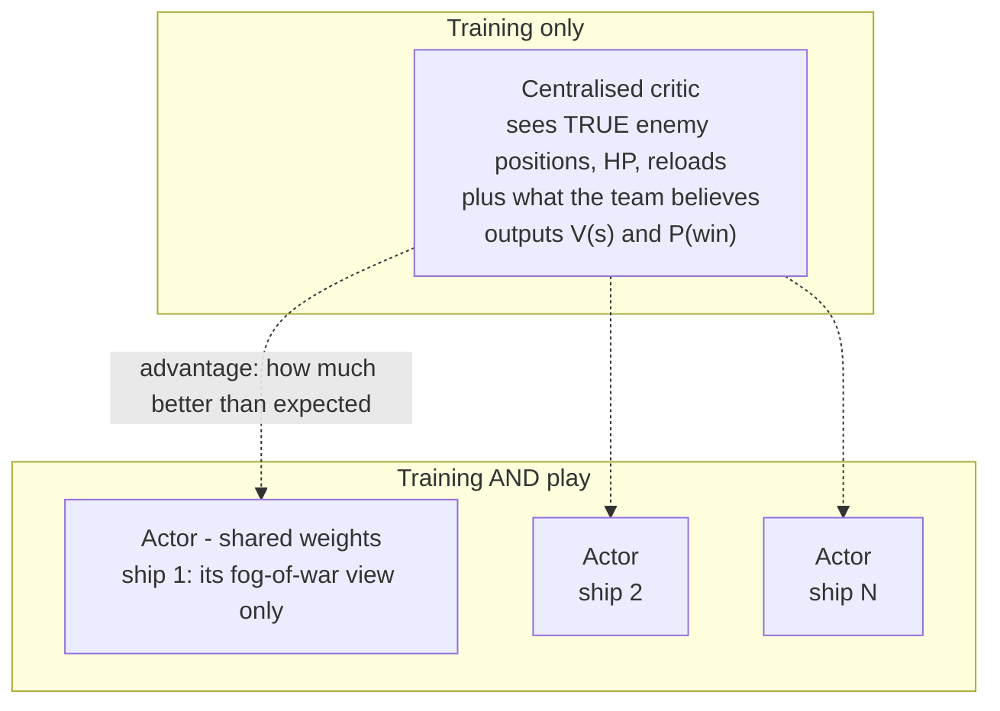

- The **actor** has to be fair, because it plays against humans. It only reads information a real
  captain would have ([RLObservation.cs](Assets/Scripts/RL/RLObservation.cs) builds it from
  `DetectionSystem` contacts, never from enemy transforms).
- The **critic** only judges how good a situation is, so it can cheat. Seeing the true enemy state
  gives a much less noisy value estimate, and with that a better advantage signal for the actor. At
  play time the critic is not needed.
- **Parameter sharing:** one actor for every ship of every class. The ship's class is part of its
  observation, so the same weights can behave like a destroyer or like a battleship. The data from
  all ships in all battles trains one network.
- **PPO** (clipped policy gradient) is stable, works with recurrent policies, and is the standard
  base for multi-agent RL in large games (the MAPPO paper, OpenAI Five, and others).

### 3.3 Every technique used, and where

| Technique | What it solves | Where |
|---|---|---|
| **MAPPO** (PPO with centralised critic) | Stable multi-agent policy gradient | [mappo.py](Training/naval_rl/mappo.py) |
| **Privileged critic** (true enemy state + belief) | Low-variance values under fog of war | `WriteCriticEnemy` in [RLObservation.cs](Assets/Scripts/RL/RLObservation.cs), `Critic` in [model.py](Training/naval_rl/model.py) |
| **Per-agent critic token** ("which ship am I") | Each ship gets its own value from the shared team picture | `Critic.forward` (`is_me` one-hot) |
| **Entity transformer encoder** | Works for 1 to 30 ships. No layer depends on fleet size. | `EntityEncoder` in [model.py](Training/naval_rl/model.py) |
| **Egocentric terrain rays** | Map-independent terrain sensing: 16 rays report open water for the ship's draft (3 km) and land that blocks sight (6 km) | `WriteTerrainRays` in [RLObservation.cs](Assets/Scripts/RL/RLObservation.cs) |
| **Obstacle tokens** | Islands, rocks and merged smoke screens as entities, with "blocks my target / my threat" flags, so cover is reasoned about on any map | `WriteObstacles`, `GatherObstacles` |
| **Terrain-aware macro actions** | "Take cover" and "return to port" reuse the game's own line-of-sight test and port service instead of being learned from scratch | `FindCover` in [RLObservation.cs](Assets/Scripts/RL/RLObservation.cs), `RLActions.Apply` |
| **Domain randomisation of maps** | The full-game stages draw a random battlefield, island density, weather, mode, cap size and fleet size, so the policy cannot memorise one map | `DEFAULT_STAGES` in [config.py](Training/naval_rl/config.py), `League._reset_message` |
| **Pointer heads** | Choosing *which* contact / zone scales with the battle | `Actor.heads` (`ptr_q`, `ptr_k`) |
| **GRU recurrent actor** | Memory under partial observability (where did that destroyer go?) | `Actor.gru`, chunked BPTT in `MAPPO.learn` |
| **Factorised multi-discrete actions + masking** | Six heads, illegal options removed before sampling | `RLActions.WriteMask`, `sample_actions` |
| **High-level "intent" actions** | Throttle and rudder alone are too hard to learn. The existing autopilot, A* and gun lead do the low-level control. | `RLActions.Apply` |
| **GAE(λ)** | Bias/variance trade-off for advantages | `MAPPO.advantages` |
| **Value normalisation** (running mean/var) | Stable critic targets as the reward scale shifts | `ValueNorm` |
| **Value clipping, gradient clipping, advantage normalisation** | PPO stability | `MAPPO.learn` |
| **Auxiliary win-probability head** | Extra supervised signal for the critic's features | `Critic.win`, `win_loss` |
| **Death masking** | Dead ships stop training the actor but keep training the critic, so their last actions still get credit | `actor_valid` vs `critic_valid` |
| **Truncation bootstrapping** | 20-minute battles are cut into 1024-step rollouts | `values[T]` bootstrap |
| **Reward shaping with annealing** | Dense early signal, then only the true objective | [rewards.py](Training/naval_rl/rewards.py) |
| **Zero-sum team reward** | Makes self-play well posed | [RLRewardTracker.cs](Assets/Scripts/RL/RLRewardTracker.cs) |
| **Curriculum learning** | Duel → 3v3 → islands → 6v6 → open maps | [league.py](Training/naval_rl/league.py), `DEFAULT_STAGES` |
| **Self-play league + PFSP** | Opponents keep improving without forgetting | `League.sample`, `League._pfsp` |
| **Behaviour cloning warm start** | Learning the full game from random play is too slow | [bc.py](Training/bc.py), [RLExpertLabels.cs](Assets/Scripts/RL/RLExpertLabels.cs) |
| **Team-frame rotation** | Both sides see "my base is south", so one policy plays either side | `RLFrames` in [RLObservation.cs](Assets/Scripts/RL/RLObservation.cs) |
| **Fixed-timestep simulation** | Game physics identical to 50 fps play, independent of CPU speed | `Time.captureDeltaTime` in `RLEnvironment.Init` |
| **Parallel environments** | Throughput. Game systems are singletons, so each process runs one battle. | `make_workers` in [env.py](Training/naval_rl/env.py) |

### 3.4 Design problems and how they are solved

| Problem | How it is solved |
|---|---|
| The actions had no way to aim, and throttle and rudder alone are too hard to learn | **Intent actions** in [RLActions.cs](Assets/Scripts/RL/RLActions.cs): six masked heads (move, speed, target, fire / hold, torpedo, ability) carried out by the existing autopilot, gun lead and turret training. `--set action_mode=lowlevel` swaps in direct rudder and throttle as an ablation. See [§7](#7-actions--what-a-ship-can-do). |
| A critic limited to what the team knows gives noisy values | [RLObservation.cs](Assets/Scripts/RL/RLObservation.cs) sends the actor only fog-of-war-legal information, but the critic also gets the true state of every enemy next to what the team believes about it. `--set critic_mode=belief` removes the privileged columns. See [§6.3](#63-critic-tokens-privileged-training-only). |
| A fixed 178-number observation vector cannot cover fleets of 1 to 30 | Entities (self, allies, contacts, zones, obstacles) go through a transformer, and targets and zones are chosen with pointer heads ([model.py](Training/naval_rl/model.py)). No layer depends on how many ships there are. See [§9](#9-the-neural-networks). |
| The reward was never defined | [RLRewardTracker.cs](Assets/Scripts/RL/RLRewardTracker.cs) reports raw components; [rewards.py](Training/naval_rl/rewards.py) holds the weights. The team part is zero-sum, and shaping fades out over training. See [§8](#8-rewards). |
| Updating after each episode does not fit 20-minute battles | Fixed-length rollouts with automatic resets ([mappo.py](Training/naval_rl/mappo.py)). The game's time limit counts as a real ending because time remaining is in the observation; a rollout cut mid-battle is bootstrapped from the critic. See [§10.3](#103-advantages-gae). |
| Game logic ran on frame-rate-dependent `Time.deltaTime` | Training sets `Time.captureDeltaTime`: every frame is exactly `sim_dt` (20 ms) of game time and physics steps once per frame, the same as playing at 50 fps. See [§5.3](#53-deterministic-time). |
| Global singletons prevent several battles in one scene | One battle per Unity process. [env.py](Training/naval_rl/env.py) launches N headless players on consecutive ports and steps them in parallel (send to all, then receive from all). |
| `ShipAI` assumed the Player fleet is always human, and damage events dropped the attacker | `Ship.Controller` is `Human`, `RuleAI` or `Learned`, for either fleet (`GameManager.SetTeamController`). `OnShipDamaged` now carries the attacker, and `Contact.spotter` records which ship produced each contact, so spotting damage can be credited. See [§2.3](#23-game-code-that-rl-hooks-into). |
| Partial observability | GRU actor, trained on 32-step chunks and reset at episode starts. See [§10.5](#105-recurrent-training-chunked-bptt). |
| The policy was blind to terrain beyond its own hull and trained on one map, so it could not adapt when the battlefield changed | Terrain rays and obstacle tokens describe the land and smoke around each ship in its own frame; the map type, land fraction, mode and weather are in the match features; and stages 3–4 randomise the battlefield. See [§6](#6-observations--what-a-ship-sees) and [§11](#11-curriculum-and-self-play-league). |
| Consumables were reduced to "has / ready / active" | Every tracked consumable also reports charges left, cooldown remaining and time left active; allies show radar / hydro range, repair and smoke; the critic sees the enemy's consumables. See [§6.2](#62-actor-tokens-fog-of-war-legal). |
| Only ever training against the scripted AI | [league.py](Training/naval_rl/league.py): curriculum stages against Recruit → Veteran → Elite, promotion on rolling win rate, then self-play (latest self, prioritised past snapshots, and the rule AI as an anchor). The learner's side is randomised every episode. See [§11](#11-curriculum-and-self-play-league). |

---

## 4. One training step, end to end

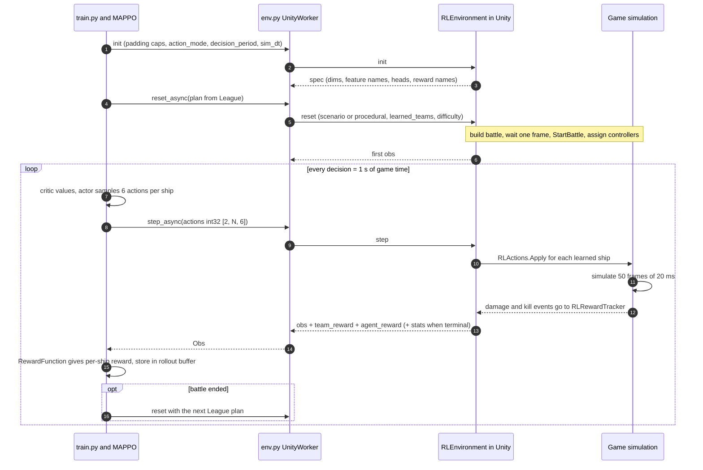

All workers are stepped in parallel. The trainer sends `step` to every worker first, then receives
from every worker, so N Unity processes simulate at the same time
([mappo.py `collect`](Training/naval_rl/mappo.py)).

---

## 5. The Unity environment

### 5.1 How a Unity process becomes an environment

- **Built player:** `NavalTrainer.x86_64 -batchmode -nographics -rlTrain -rlPort 5005`. The trainer
  launches these itself ([env.py `launch_player`](Training/naval_rl/env.py)), one per worker on
  consecutive ports, with logs in `runs/<run>/unity_logs/`.
- **Editor:** tick **GameBootstrap → Rl Training Server**, press Play, then run
  `python train.py --ports 5005`. This is useful for watching training live.
- `GameBootstrap.Awake` sees the flag, uncaps the frame rate, sets `runInBackground`, and creates
  `RLEnvironment` instead of the main menu.

### 5.2 The lockstep state machine

The game only advances when the trainer asks it to. `RLEnvironment.Update()` runs this state machine:

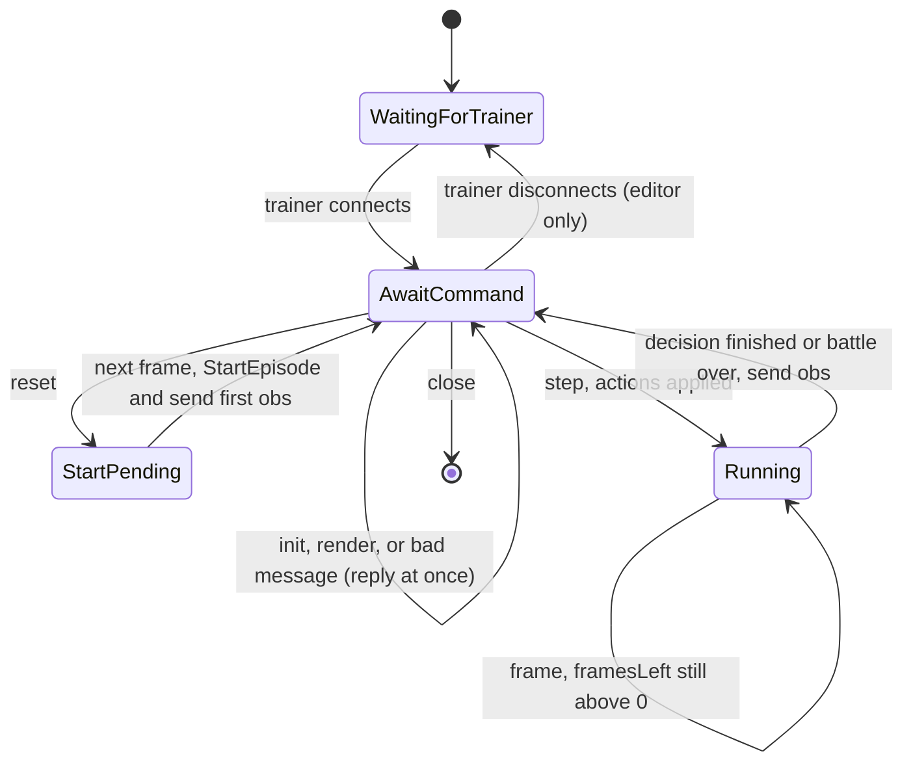

- **init** sets the padding caps, `action_mode`, `decision_period`, `sim_dt` and `reflexes`, then
  replies with the **spec**.
- **reset** builds the battle (from a `Scenario` JSON or procedurally). Terrain is only regenerated
  when its key (seed, preset, density, zones, islands, fleet size) changes, so resets are fast. The
  battle starts one frame later, so the previous hulls are really destroyed first.
- **step** reads `int32 [2, max_team, 6]`, calls `RLActions.Apply` for each ship of each *learned*
  team, and then lets `framesPerDecision` frames run.
- If the battle ends mid-decision (victory or defeat), the observation is sent immediately with
  `terminal = true`.
- Errors inside a handler are sent back as `{"type":"error"}`, so the trainer never hangs waiting.

### 5.3 Deterministic time

`Init` sets `Time.captureDeltaTime = sim_dt` (default **0.02 s**). Every frame is then exactly 20 ms
of game time, however fast the CPU runs it. With `fixedDeltaTime = sim_dt`, physics steps once per
frame. AI, navigation, gunnery and detection all see the same `dt` as a normal 50 fps game. Raising
`timeScale` would instead give them large, frame-rate-dependent steps.

```text
decision_period = 1.0 s   sim_dt = 0.02 s   =>   50 frames per decision
```

### 5.4 Which ships are agents

At `StartEpisode` each team's ships are put in **fixed slots** (row *i* is always the same hull,
even after it sinks). The first `max_team` hulls get slots. Any extra hulls of a learned team fall
back to the rule AI. For learned ships:

- `AI.AutoEvade` and `AI.AutoDamageControl` stay on when `reflexes = true` (torpedo dodging and
  damage control are reflexes, not decisions).
- `ExternalHelm` is set only in the low-level ablation.
- `LearnedMove = -1`, target cleared, navigation stopped.

### 5.5 Wire protocol

Both sides use the same framing ([RLWire.cs](Assets/Scripts/RL/RLWire.cs) ⇄
[protocol.py](Training/naval_rl/protocol.py)):

```text
┌──────────────┬──────────────┬─────────────────────────┬──────────────────────────────────┐
│ uint32 total │ uint32 jsonN │ JSON header (jsonN B)   │ binary blob: arrays back to back │
│ (payload len)│              │ {"type":..., "arrays":[ │ little-endian f4 / i4, C order   │
│              │              │   {name,dtype,shape}]}  │                                  │
└──────────────┴──────────────┴─────────────────────────┴──────────────────────────────────┘
```

| Trainer sends | Environment replies |
|---|---|
| `init` {max_team, max_allies, max_contacts, max_zones, max_obstacles, action_mode, decision_period, sim_dt, reflexes} | `spec` (all dims, feature names, heads, reward component names) |
| `reset` {use_scenario, scenario \| mode/preset/density/weather/ships/seed, learned_teams, record_teams, opponent_difficulty, episode_seed, time_limit} | first `obs` |
| `step` + array `actions` int32 `[2, N, 6]` | `obs` |
| `render` {path, width, height, reveal} | `rendered` (PNG written; needs a player with graphics) |
| `close` | the player quits |

Nothing is hard-coded on the Python side: every size comes from the `spec`.

**The `obs` message.** Every array has a leading **team axis of 2** (0 = Player, 1 = Enemy). With
the trainer defaults N = `max_team` = 8, A = 7, C = 8, Z = 5, O = `max_obstacles` = 8:

| Array | Shape | Meaning |
|---|---|---|
| `self` | [2, N, 200] | own ship state (172) + match state (28) |
| `allies`, `ally_mask` | [2, N, A, 22], [2, N, A] | squadron mates, nearest first |
| `contacts`, `contact_mask` | [2, N, C, 33], [2, N, C] | team contacts, nearest first |
| `zones`, `zone_mask` | [2, N, Z, 12], [2, N, Z] | capture zones |
| `obstacles`, `obstacle_mask` | [2, N, O, 14], [2, N, O] | islands, rocks and smoke screens, nearest edge first |
| `action_mask` | [2, N, 53] | 1 = legal, over all heads concatenated |
| `alive` | [2, N] | ship afloat |
| `critic_own` | [2, N, 173] | own ship state + alive |
| `critic_enemy`, `critic_enemy_mask` | [2, N, 53], [2, N] | true enemy state (consumables included) + belief |
| `critic_zones`, `critic_zone_mask` | [2, Z, 10], [2, Z] | absolute zone state |
| `critic_match` | [2, 31] | match state + true fleet strengths |
| `team_reward` | [2, 11] | raw team reward components this step |
| `agent_reward` | [2, N, 5] | raw per-ship reward components this step |
| `learned` | [2] | which teams are policy-controlled |
| `expert_actions`, `expert_valid` | [2, N, 6], [2, N] | behaviour cloning labels (recorded teams only) |

The JSON header also carries `terminal`, `winner`, `draw` (always false — a level match goes to
overtime, so every episode has a winner), `reason`, `battle_time`, `episode`,
`decision`, `ships` (hulls per team), a `diag` block (sim time per decision, of which observation
building `obs_ms`, GC count, heap, object count), and on the final step `stats` (scores, kills, and the [RLMetrics](Assets/Scripts/RL/RLMetrics.cs) behaviour metrics).

---

## 6. Observations — what a ship sees

### 6.1 Coordinate frames

- **Team frame** (absolute positions and headings): the Enemy team sees the world **rotated
  180°**, so every policy believes its own base is to the south. A rotation is used rather than a
  mirror, so port and starboard stay correct, and with them turret arcs and torpedo tubes.
- **Egocentric frame** (ally, contact, zone and obstacle tokens, terrain rays, ports, incoming
  torpedoes): `x` = to starboard, `y` = ahead, relative to the observing ship.
- **Scale:** 1 world unit = 10 m. Relative distances are divided by 1000 (10 km), ranges by 2800
  (the longest detection range), absolute positions by the half map size.

Nothing in the observation identifies a particular map. Terrain reaches the policy only through
rays and obstacle tokens in the ship's own frame, so what it learns about using an island on one
battlefield applies to every other.

### 6.2 Actor tokens (fog-of-war legal)

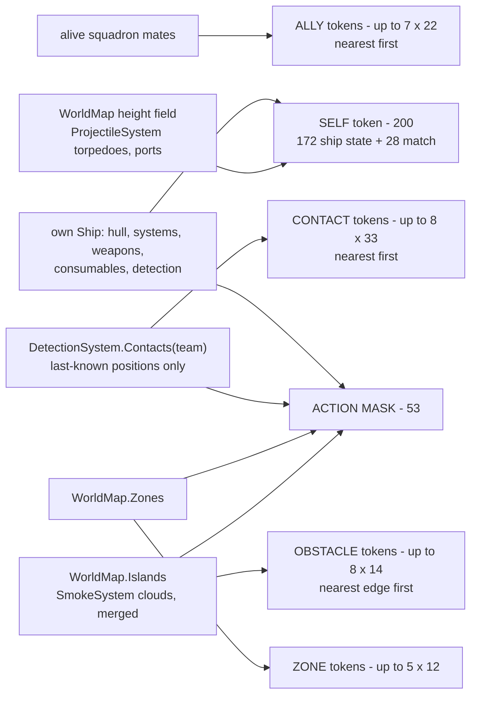

**Self: ship state (172).**

| Group | Features |
|---|---|
| Hull | class one-hot (DD / CA / BB / SS / TR), HP, 7 system integrities (hull, engine, steering, main guns, secondaries, sensors, propulsion) |
| Motion | speed, throttle, heading sin/cos, x, y (team frame) |
| Weapons and supply | main reload, main ready, torpedo reload, torpedoes ready, torpedo ammo, main ammo, AP loaded, carries torpedoes, homing torpedoes, fuel, needs resupply |
| **Consumables** (×12) | for ShellHE, ShellAP, SmokeScreen, EngineBoost, SurveillanceRadar, HydroacousticSearch, RepairParty, DamageControl, SpotterPlane, SonarPing, Hydrophone, SubmarineSurveillance: **has / ready / active / charges left / cooldown remaining / time left active** |
| Status | fires, floods, damage control ready, spotted, sonar-locked, in smoke, recently fired, detectability, spot range |
| Submarine | depth one-hot, depth changing, battery |
| Seabed | depth under keel, shoal gradient x/y |
| Reach | gun range, torpedo range, assured-detection range (radar / hydro / hydrophone / surveillance running) |
| Situation | evading, time since hit, in a zone |
| **Terrain rays** (16 + 16) | clockwise from the bow every 22.5°: distance the ship can sail before the water is too shallow **for its own draft** or the map ends (to 3 km), and distance to land high enough to block line of sight (to 6 km). 1 = clear. |
| **Incoming torpedoes** | spotted enemy torpedoes that will pass within ~1.6 hull lengths: count, nearest one's position, time to impact; friendly torpedoes on the same course |
| **Ports** | own harbour: position, distance, inside the service radius, still standing; enemy harbour position and distance |
| Map edge | distance to the nearest edge |

**Self: match (28).** Time left (fraction and per 20 min), both scores, both zone point rates, own
alive fraction, enemy alive fraction *as publicly known* (from kills), weather visibility, repair
supply, **game mode one-hot** (domination / skirmish / fleet battle / capture and control / escort),
**weather one-hot** and time to the next weather change, sea state, **map type one-hot** (archipelago
/ open sea / strait), **land fraction** of the map, zone count, both fleet sizes.

**Ally (22).** Relative x/y, distance, relative heading sin/cos, speed, class one-hot, HP, spotted,
main ready, torpedoes ready, in smoke, same target as me, **assured-detection range** (its radar /
hydro running), **repair running**, **making smoke**, submerged, on fire.

**Contact (33).** Relative x/y, distance, relative heading, aspect angle, contact state (confirmed /
sonar / last-known), age, identified, class one-hot (if identified), HP and speed (only if
confirmed), in gun range, in torpedo range, fraction of my barrels that bear, torpedo firing
solution, is my target, how many allies target it, line of sight, submerged, **in smoke**, **pinged**
(our homing torpedoes will track it), **firing** (gun flashes), and — once its class is identified,
since class stats are public — **its gun range, its torpedo range, and whether I am inside its gun
range**.

**Zone (12).** Relative x/y, distance, radius, owner (mine / theirs / neutral), capture progress
(signed for my team), contested, how many of mine inside, am I inside, under attack.

**Obstacle (14).** Relative x/y, distance to its edge and centre, radius, hazard (shallow shelf)
radius, island / rock / smoke, smoke is ours, smoke life left, **blocks my target** (it sits between
me and what I am shooting at), **blocks my threat** (between me and the heaviest identified gun that
can reach me), am I inside it. A smoke screen is laid as a trail of overlapping puffs, so overlapping
puffs are merged into one screen with a bounding circle, and smoke may take at most half the slots
so islands are never crowded out.

Dead and padded rows stay all zeros. Their mask only allows option 0 of each head, so they still
form a valid probability distribution (MAPPO death masking).

### 6.3 Critic tokens (privileged, training only)

| Token | Size | Contents |
|---|---|---|
| match | 31 | the 28 match features + my fleet strength, their fleet strength (damage-weighted, by fleet point cost), their **true** alive fraction |
| own ship ×N | 173 (+1 "is me" added in Python) | the same 172 ship-state features (terrain rays included) + alive |
| enemy ×N | 53 | `alive`, then **columns 1–44 = ground truth** (true x/y, heading, speed, class, HP, main reload, torpedoes ready, in smoke, radar active, detectability, sub depth, and **every consumable's ready / active**), then **columns 45–52 = team belief** (confirmed / sonar / last-known / none, age, believed x/y, belief error in 10 km units) |
| zone ×Z | 10 | absolute x/y, radius, owner, progress, contested, mine inside, theirs inside |

Having both truth and belief lets the critic learn "we think the destroyer is here but it's actually
over there", which is exactly the uncertainty the actor has to play around. The
`critic_mode=belief` ablation zeroes columns 1–44 (see `spec.enemy_privileged = [1, 45]`).

---

## 7. Actions — what a ship can do

### 7.1 The six heads (intent mode, the default)

| Head | Options | Meaning |
|---|---|---|
| **move** | 15 fixed + 1 per zone (pointer) | `0` keep (repeat the last movement order) · `1–8` compass legs N, NE, E, SE, S, SW, W, NW in the team frame · `9` close on target · `10` turn broadside to target · `11` open range · `12` regroup on the nearest BB/CA · `13` **take cover** from the biggest threat · `14` **return to port** · `15+i` go to zone *i* |
| **speed** | 5 | full · ⅔ · ⅓ · stop · astern |
| **target** | 1 fixed + 1 per contact (pointer) | `0` auto (the ship's own gunnery choice) · `j` focus contact *j* |
| **fire** | 2 | fire at will · hold fire (stay concealed) |
| **torpedo** | 2 | none · launch |
| **ability** | 15 | `0` none · `1–12` ShellHE, ShellAP, SmokeScreen, EngineBoost, SurveillanceRadar, HydroacousticSearch, RepairParty, DamageControl, SpotterPlane, SonarPing, Hydrophone, SubmarineSurveillance · `13` dive · `14` surface |

With the default caps (Z = 5, C = 8) there are 20 + 5 + 9 + 2 + 2 + 15 = **53 logits** per ship. The
joint action is sampled as **six independent masked categoricals**. The log-probability of the joint
action is the sum over heads, and so is the entropy.

### 7.2 Action masks

What is legal, as decided by [RLActions.WriteMask](Assets/Scripts/RL/RLActions.cs:41):

| Option | Legal when |
|---|---|
| move keep | always |
| compass leg *k* | the point 1.5 km away in that direction is in bounds and navigable for this ship's draft |
| close / broadside / open | at least one contact exists |
| regroup | a friendly battleship or cruiser is alive |
| take cover | there is a confirmed threat (the heaviest identified gun in range, else the nearest confirmed contact) and a navigable spot 1.1–2.6 km away from it that land or smoke hides from it — tested with the detection system's own line-of-sight check |
| return to port | the ship's harbour stands, and a visit pays off: HP below 60%, needs resupply, fuel or main ammunition below 30%, torpedoes empty — or it is already being serviced there |
| zone *i* | the zone exists |
| speed, fire | always |
| target *j* | contact row *j* exists (lost contacts can still be hunted) |
| torpedo launch | tubes loaded **and** some live contact offers a real firing solution (in range and off the beam) |
| shell HE / AP | not already loaded **and** 20 s since the last switch (otherwise an untrained policy flips every second) |
| damage control | ready **and** there is something to fix (fire, flooding, or a system below 60%) |
| repair party | ready **and** HP < 98% |
| smoke | ready and weapons allow smoke |
| other consumables | ready |
| dive / surface | submarine, not already changing depth, not already deep / surfaced |

Masking out wasted actions (a repair at full HP, torpedoes with no solution) saves the policy
thousands of samples it would otherwise spend unlearning them.

### 7.3 How a chosen action becomes orders

Carried out by [RLActions.Apply](Assets/Scripts/RL/RLActions.cs:205):

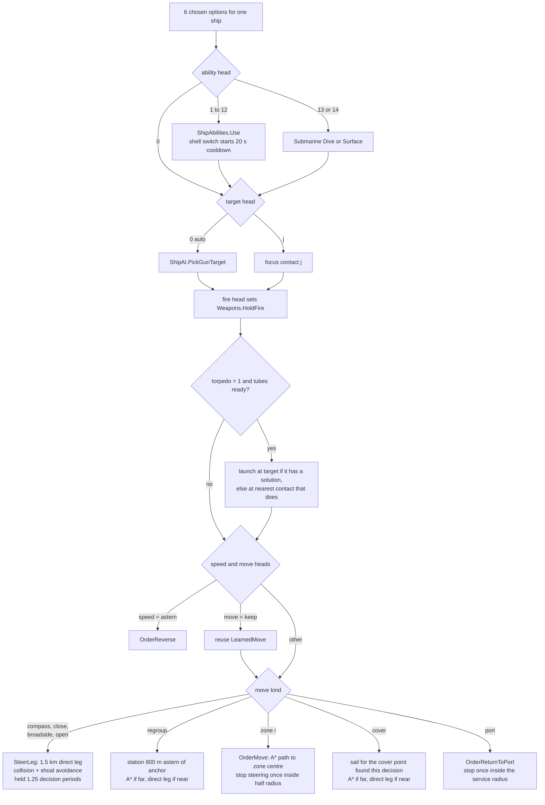

Order of application: consumables first (so smoke or radar is up before the movement that needs
it), then target, fire discipline, torpedoes, then speed and movement.

- **Short legs** (`SteerLeg`) are steered directly with collision and shoal avoidance, and are
  re-aimed every decision. They stay in force for `1.25 × decision_period`, so the ship never drops
  back to a standing order between decisions.
- **Long legs** (zone, far regroup, far cover, port) go through A* (`OrderMove`), and are only re-planned when the
  destination really moved (`OrderMoveIfChanged`).
- **Keep** repeats the last movement order. Without it, holding a course would mean choosing the
  same leg again every second.
- The autopilot, gun lead and turret training that the human player and rule AI use also execute
  the policy's orders. The policy decides *what*, the game handles *how*.

### 7.4 Low-level ablation

With `--set action_mode=lowlevel` the move head becomes the rudder (hard port, port, amidships,
starboard, hard starboard) and the speed head the throttle (+1, +0.5, 0, −0.5, −1).
`ExternalHelm = true` bypasses navigation. This mode exists to show why intent actions are needed.

---

## 8. Rewards

The environment only reports **raw, normalised components**. The **weights live in Python**
([rewards.py](Training/naval_rl/rewards.py)), so reward design can change without rebuilding the
game.

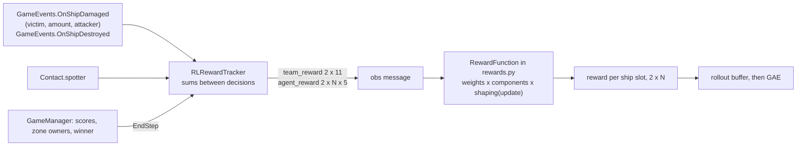

### 8.1 Components and default weights

**Team components** (shared by every ship of the side):

| Component | Meaning | Weight | Annealed? |
|---|---|---|---|
| `score_delta` | change in (my score − their score) / 1000: zone income + kill points | **+2.0** | no (objective) |
| `damage_dealt` | enemy HP removed, as a fraction of the enemy fleet's starting HP | +1.0 | yes |
| `damage_taken` | own HP lost, as a fraction of our starting HP | −1.0 | yes |
| `zones_captured` / `zones_lost` | captures completed / lost this step | +0.1 / −0.1 | yes |
| `kills` / `losses` | hulls sunk, as a fraction of the fleet | +0.3 / −0.3 | yes |
| `friendly_fire_taken` | own HP lost to own ordnance | −0.5 | yes |
| `win` / `loss` / `draw` | terminal outcome, final step only (`draw` is never set: a level match goes to overtime) | **+1 / −1 / 0** | no (objective) |

**Agent components** (per ship, credit assignment):

| Component | Meaning | Weight |
|---|---|---|
| `damage_dealt` | damage this ship did, in victim hull fractions | +0.2 |
| `spotting_damage` | damage **team mates** did to targets **this ship was spotting** | +0.2 |
| `friendly_fire_dealt` | damage this ship's ordnance did to its own side | −0.5 |
| `damage_taken` | own hull lost | 0.0 |
| `sunk` | 1 on the step this ship went down | −0.1 |

### 8.2 The formula

For ship slot *i* at step *t* after *u* PPO updates:

$$
r_{i,t} = \sum_k w^{team}_k \, c^{team}_{k,t} \, s_k \;+\; s(u) \sum_k w^{agent}_k \, c^{agent}_{i,k,t}
$$

$$
s(u) = 1 - (1 - \text{floor}) \cdot \min\!\left(1, \frac{u}{\text{anneal\_updates}}\right), \qquad
s_k = \begin{cases} 1 & k \in \{\text{score\_delta, win, loss, draw}\} \\ s(u) & \text{otherwise} \end{cases}
$$

With the defaults (`anneal_updates = 1500`, `shaping_floor = 0.1`), shaping fades from ×1.0 to ×0.1,
while the real objective (score margin and result) keeps full weight. The final policy therefore
optimises for **winning** rather than for proxies such as damage. Rewards are multiplied by the
"slot existed at episode start" mask.

**Zero-sum:** damage dealt by one side is the other side's damage taken, kills mirror losses, and
the score margin is antisymmetric. Because the main terms are zero-sum, self-play has a well-defined
target.

**Spotting credit:** in `OnDamaged`, the tracker looks up the victim's `Contact` for the attacker's
team. If its `spotter` is a different, living ship of the attacker's team, that spotter gets
`spotting_damage`. This rewards a destroyer that stays close and keeps an enemy lit for the
battleships. It can be disabled with `--set spotting_reward=false`.

---

## 9. The neural networks

Defaults: `d_model = 128`, 4 attention heads, 2 transformer layers, GRU hidden 128.
**Actor ≈ 588 k parameters, critic ≈ 399 k.** A policy file is ~2.35 MB with the actor only and
~3.95 MB with the critic included.

### 9.1 Actor

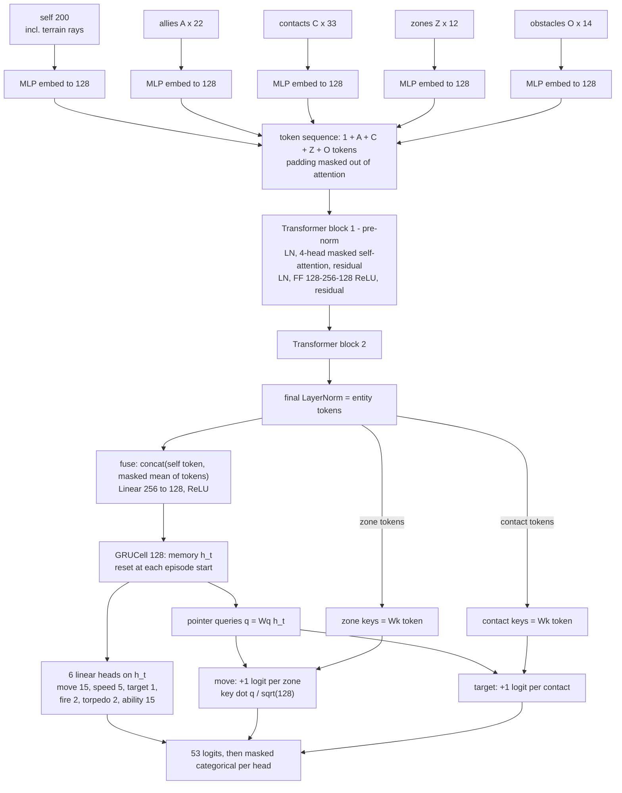

- **Entity encoder:** each token type has its own 2-layer MLP embedding. The transformer lets every
  token attend to every other, so the self token can "look at" the most threatening contact and a
  contact token can "know" which ally is already shooting it.
- **Pointer heads:** the number of target options equals the number of contacts, whatever that is.
  The weights do not depend on the caps, so a policy trained at 6v6 can fly a 12v12 fleet
  (`evaluate.py --max-team 12`).
- **GRU:** gives the ship memory across decisions, for example of contacts that went dark or what it
  was doing a few seconds ago.

### 9.2 Critic (centralised)

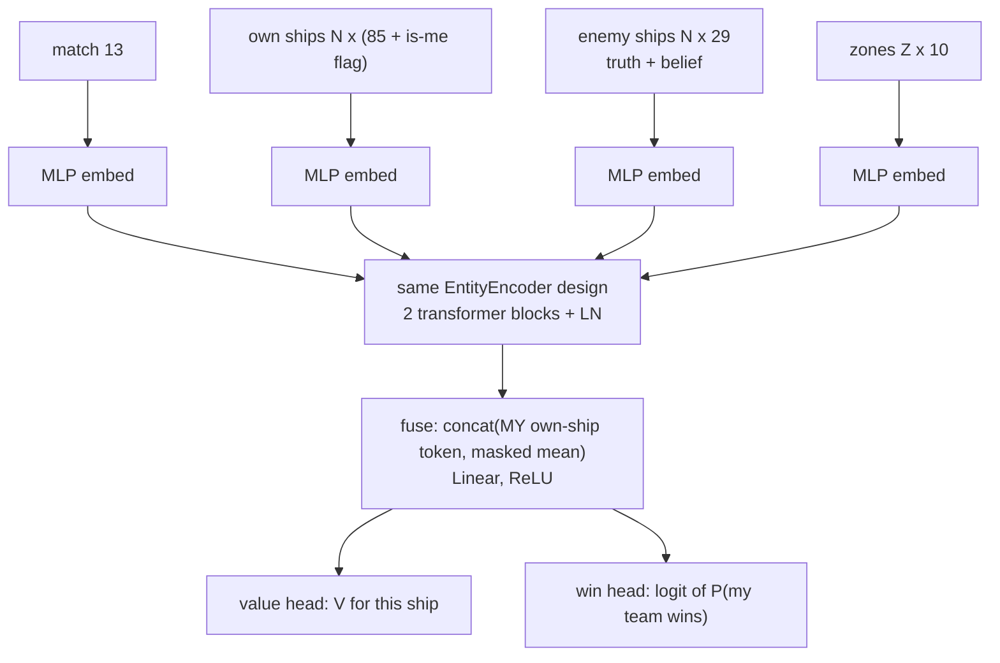

The critic is evaluated **once per agent**. The same team picture is repeated N times, and each copy
has a different "is me" one-hot, so every ship gets its own value. The **win head** is an auxiliary
task: binary cross-entropy against the actual episode outcome (1 win, 0 loss, 0.5 draw). It is
exported with the policy and computable in C# (`RLPolicy.Evaluate`), but no game UI reads it yet.

The `LocalCritic` (IPPO ablation) has the same shape but reads only the actor's observation.

---

## 10. The MAPPO training algorithm

### 10.1 The loop

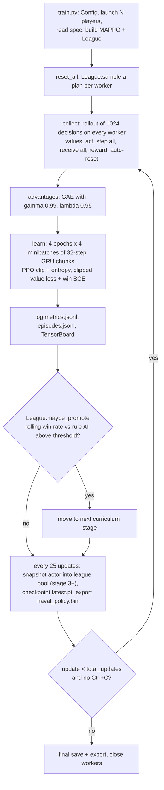

### 10.2 Rollout buffer layout

Every worker has **two team rows** (Player, Enemy), and every team row has **N agent slots**.
Buffers are shaped `[T, W, 2, N, ...]` (T = 1024 rollout steps, W = workers). Some masks decide what
trains:

| Mask | Definition | Used for |
|---|---|---|
| `active[t,w,team]` | this team's experience trains the policy (the learner's side, or both sides when playing against *latest*) | rule-AI and snapshot sides are acted for but not trained on |
| `own_mask` / exists | the slot held a hull at episode start | padding |
| `alive` | the hull is still afloat | death masking |
| **actor_valid** | `active × alive × exists` | policy loss, entropy |
| **critic_valid** | `active × exists` | value loss. Dead ships' slots keep learning values from the shared team reward. |

In `act()`, team rows are **grouped by which actor controls them** (the current actor for
learner/latest, a frozen snapshot actor for snapshot opponents, nothing for the rule AI), so each
network runs one batched forward pass.

### 10.3 Advantages (GAE)

$$
\delta_t = r_t + \gamma\, V(s_{t+1})(1 - d_t) - V(s_t), \qquad
\hat{A}_t = \delta_t + \gamma \lambda (1 - d_t)\, \hat{A}_{t+1}, \qquad
R_t = \hat{A}_t + V(s_t)
$$

- `d_t = 1` only when the **game** ended. The game clock is a real terminal, because time remaining
  is part of the observation.
- A rollout cut mid-battle is a **truncation**: `V(s_T)` is bootstrapped from the critic.
- Advantages are normalised over actor-valid entries.

### 10.4 Losses

Policy (clipped surrogate, masked by `actor_valid`), with $\rho = \exp(\log\pi_\theta(a|o) - \log\pi_{old}(a|o))$:

$$
L^{actor} = -\,\mathbb{E}\left[\min\left(\rho \hat{A},\ \text{clip}(\rho, 1-\epsilon, 1+\epsilon)\hat{A}\right)\right] - c_{ent}\, \mathbb{E}[H(\pi)]
$$

Critic (in value-normalised space, masked by `critic_valid`):

$$
L^{V} = \mathbb{E}\left[\max\left((V - \tilde{R})^2,\ (V^{clip} - \tilde{R})^2\right)\right], \quad
V^{clip} = V_{old} + \text{clip}(V - V_{old}, -0.2, 0.2)
$$

$$
L^{critic} = 1.0 \cdot L^{V} + 0.25 \cdot \text{BCE}(\text{win logit},\ \text{outcome})
$$

- Separate **Adam** optimisers for actor (lr 2e-4) and critic (lr 5e-4), grad-norm clip 1.0.
- Entropy coefficient decays linearly **0.01 → 0.001 over 300 updates**.
- `ValueNorm` keeps a running mean and variance of returns (β = 0.99999). The critic predicts in
  normalised units, which are de-normalised for GAE.
- `actor_freeze_updates`: train only the critic for the first K updates. This is used after
  behaviour cloning, so a random critic cannot wreck the cloned actor.

### 10.5 Recurrent training (chunked BPTT)

Each sequence (worker, team, slot) is cut into **32-step chunks**. The GRU hidden state **at the
start of each chunk was stored during collection**, so training replays the chunk from the right
memory. `starts` flags zero the memory where a new episode began inside a chunk. Chunks are shuffled
into minibatches.

### 10.6 Hyperparameters

Defaults, from [config.py](Training/naval_rl/config.py):

| Group | Setting | Default |
|---|---|---|
| env | workers / max_team / max_allies / max_contacts / max_zones / max_obstacles | 8 / 8 / 7 / 8 / 5 / 8 |
| env | decision_period / sim_dt / reflexes | 1.0 s / 0.02 s / true |
| PPO | rollout / epochs / minibatches / chunk | 1024 / 4 / 4 / 32 |
| PPO | gamma / lambda / clip / value_clip | 0.99 / 0.95 / 0.2 / 0.2 |
| PPO | lr_actor / lr_critic / max_grad_norm | 2e-4 / 5e-4 / 1.0 |
| PPO | ent_coef → ent_coef_final over ent_decay_updates | 0.01 → 0.001 over 300 |
| PPO | value_coef / win_coef / total_updates | 1.0 / 0.25 / 3000 |
| net | d_model / heads / layers / hidden | 128 / 4 / 2 / 128 |
| reward | anneal_updates / shaping_floor / spotting_reward | 1500 / 0.1 / true |
| league | start_stage / selfplay_from_stage | 0 / 3 |
| league | mix_latest / mix_snapshot / mix_rule | 0.5 / 0.3 / 0.2 |
| league | snapshot_every / pool_size / winrate_window / jitter | 25 / 20 / 100 / 40 units |
| io | checkpoint_every / export_every | 25 / 25 |

Override anything with `--set key=value` (values are parsed as JSON), or `--config file.yaml`.

---

## 11. Curriculum and self-play league

### 11.1 Curriculum stages

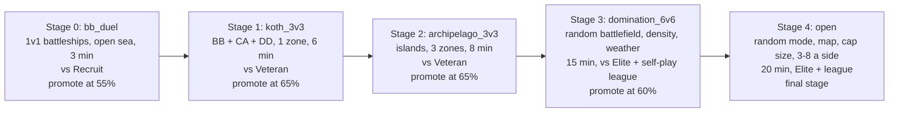

| Stage | What it teaches | Source | Opponent | Min episodes | Promote at |
|---|---|---|---|---|---|
| 0 `bb_duel` | gunnery, target choice, angling, fire timing | [scenarios/stage0_bb_duel.json](Training/scenarios/stage0_bb_duel.json) | Recruit | 100 | 55% (random play: 31%, a simple scripted tactic: 55%) |
| 1 `koth_3v3` | capturing while fighting, mixed classes | [scenarios/stage1_koth_3v3.json](Training/scenarios/stage1_koth_3v3.json) | Veteran | 100 | 65% |
| 2 `archipelago_3v3` | spotting, smoke, radar, islands | [scenarios/stage2_archipelago_3v3.json](Training/scenarios/stage2_archipelago_3v3.json) | Veteran | 150 | 65% |
| 3 `domination_6v6` | the full game **on any battlefield** | procedural: random preset (archipelago / open sea / strait), island density and weather; a new map every 8 episodes per worker | Elite + league | 200 | 60% |
| 4 `open` | generalisation over modes, maps and fleet sizes | procedural: random mode (domination / skirmish / fleet battle / capture and control), preset, density, weather, cap radius 1.3–2 km, 3–8 a side; a new map every 4 episodes | Elite + league | — | final stage |

The scenario files use the Scenario editor's JSON format, so any battle saved in the editor can be
used as a stage.

**Promotion:** `League.maybe_promote()` moves to the next stage when the rolling win rate (last 100
games against the rule AI **at or above the stage difficulty**) clears the threshold after the
minimum number of episodes.

**Variety per episode:** the learner's side is random (Player or Enemy). Scenario ships are jittered
by ±40 units and ±15° heading. Procedural worlds are regenerated every `world_reuse` episodes, and
every episode gets a fresh gameplay seed (shell dispersion, fires, and so on). In a procedural stage
`"preset"`, `"density"`, `"weather"` and `"mode"` can be a number, `"random"` or a list to draw from,
and `"capture_radius"` a `[min, max]` range — this is what keeps the policy from memorising a map.

### 11.2 Self-play league (stage 3 onwards)

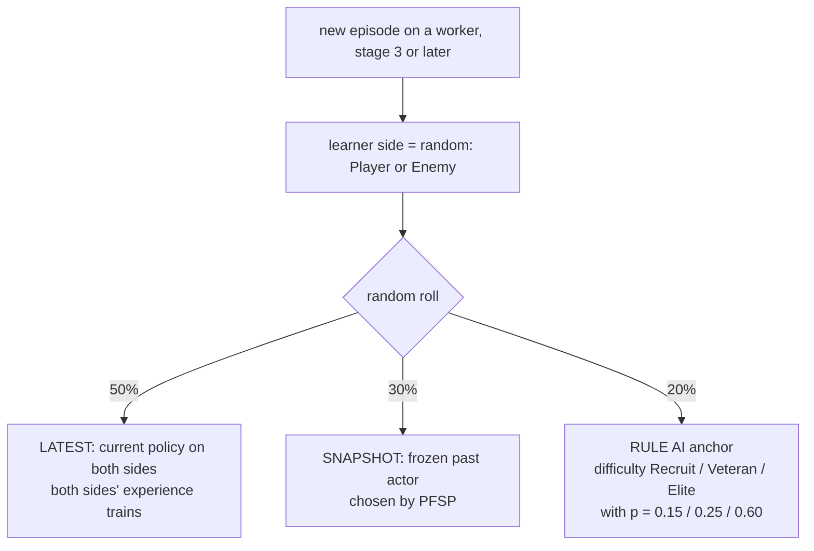

- **Snapshots:** every 25 updates the actor is saved to `runs/<run>/snapshots/` and added to the
  pool (max 20). The **first snapshot is kept forever** as a fixed reference, and the next-oldest is
  dropped when the pool is full.
- **PFSP (prioritised fictitious self-play):** snapshot *s* is chosen with weight
  `(1 − winrate_s)² + 0.02`, where `winrate_s = (wins + 1) / (games + 2)`. Opponents the learner
  still loses to come up more often.
- **Rule AI anchor:** keeps the policy from forgetting how to beat the scripted AI, and from
  drifting into strategy cycles that only work against itself.

---

## 12. Behaviour cloning warm start

Learning the full 6v6 game from random play is slow and fragile. Even the 1v1 duel reached only
0.42 after ~25 minutes. So the recipe is **imitate first, then reinforce**, the same idea as
AlphaStar.

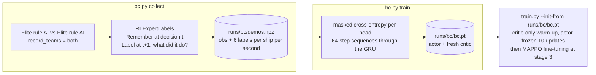

### 12.1 How rule-AI behaviour is labelled

The rule AI steers continuously and never "chooses head options", so
[RLExpertLabels.cs](Assets/Scripts/RL/RLExpertLabels.cs) infers each decision from what changed
between two observations:

| Head | Label rule |
|---|---|
| ability | shell type changed → that shell. A consumable's cooldown restarted → that consumable (damage control skipped, since it is a reflex). Sub target depth changed → dive / surface. |
| torpedo | torpedo ammo went down → launch |
| fire | `Weapons.HoldFire` |
| target | `0` (auto) unless the ship's target differs from its own `PickGunTarget()`, then that contact's index |
| speed | throttle bins: ≥0.83 full, ≥0.5 ⅔, ≥0.16 ⅓, else stop. Reverse → astern. |
| move | 0) heading home to the harbour → port; retreating behind terrain from a threat (`ShipAI.TakingCover`) → cover. 1) fleet commander assigned a zone (hold / contest / decap) → that zone. 2) A* path ending in a zone → that zone. 3) Relative to target bearing: <35° close, >145° open, 65–115° broadside. 4) Otherwise the nearest compass leg (team frame). 5) Parked in a zone → that zone, parked elsewhere → keep. |

Any label that would be illegal under the mask the ship saw is replaced by option 0. Step 1 of the
move rule was added in "v2". In v1 the policy almost never chose "go to zone", won the fights, and
lost on points.

### 12.2 Training

- `bc.py collect --battles 120`: stages 1–4 weighted 0.2 / 0.2 / 0.4 / 0.2, 8 workers, about
  890 k decisions.
- `bc.py train`: 64-step windows, 10% of ship sequences held out, Adam 3e-4, 8 epochs, batch 128.
  It reports held-out accuracy per head.
- Then MAPPO fine-tuning from `bc.pt` at stage 3, with conservative settings so the cloned
  behaviour is not thrown away:

  | Setting | Value | Why |
  |---|---|---|
  | `actor_freeze_updates` | 10 | Train only the critic at first, so a random critic cannot wreck the cloned actor |
  | `lr_actor` | 5e-5 | Small actor steps |
  | `ent_coef` → `ent_coef_final` | 0.002 → 0.0005 | Low exploration: the policy already knows what to do |
  | `gamma` | 0.995 | Longer horizon for the full 20-minute game |
  | `minibatches` | 16 | Smaller, more frequent updates |

The exact command is in [Training/README.md](Training/README.md#recommended-recipe-for-the-full-game).
[pipeline_bc_mappo.sh](Training/pipeline_bc_mappo.sh) chains all of it: collect (if needed) → BC →
evaluate → install in the game → MAPPO → automatic checkpoint evaluation.

---

## 13. Export and in-game inference

### 13.1 The policy file

[export.py](Training/naval_rl/export.py) writes it every `export_every` updates and when a run ends,
atomically (`.tmp` then rename, because the game may be reading it):

```text
┌────────┬───────────────┬────────────────────┬──────────────────────────────────┬────────────────────────┐
│ "NAVP" │ int32 version │ int32 header bytes │ JSON header                      │ float32 tensors        │
│ 4 B    │ = 1           │                    │ d, heads, layers, hidden, dims,  │ back to back, PyTorch  │
│        │               │                    │ action_heads, action_mode,       │ state_dict order,      │
│        │               │                    │ decision_period, has_critic,     │ offsets in the header  │
│        │               │                    │ vn_mean, vn_std, tensors[...]    │                        │
└────────┴───────────────┴────────────────────┴──────────────────────────────────┴────────────────────────┘
```

Default location: [Assets/StreamingAssets/RL/naval_policy.bin](Assets/StreamingAssets/RL/).

### 13.2 Running the network in C#

[RLPolicy.cs](Assets/Scripts/RL/RLPolicy.cs) re-implements every operation from `model.py`: Linear,
ReLU, LayerNorm, multi-head attention, masked mean, GRUCell (PyTorch gate order r, z, n) and pointer
dot products. It feeds **exactly** the ships, contacts and zones that exist, with no padding.
Attention over only the real tokens gives the same numbers as padded training batches.

**Parity test:** [tests/test_policy_parity.py](Training/tests/test_policy_parity.py) exports a random
network and a random input case, runs the C# code through `dotnet` ([tests/parity/](Training/tests/parity/)),
and checks it against PyTorch (asserted to 1e-3; in practice about 1e-7).

### 13.3 Flying ships in normal play

[RLPolicyDriver.cs](Assets/Scripts/RL/RLPolicyDriver.cs) flies every ship whose `Controller == Learned` outside of
training:

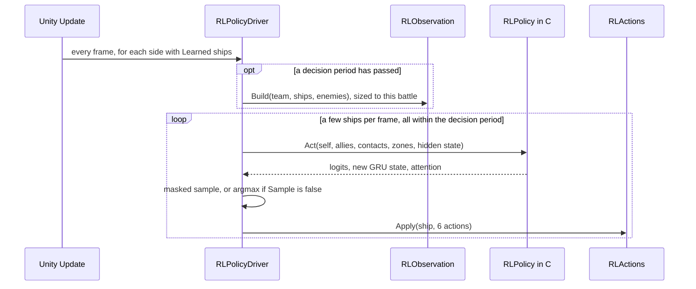

- Loaded at startup by `GameBootstrap`. `TryLoad` checks every observation dimension and every
  head's fixed option count, so a policy trained on an older layout is refused with a clear status
  message instead of misbehaving. The obstacle count per ship is read from the policy file
  (`max_obstacles`), so the game feeds the same number of obstacle tokens the network trained with.
- It is inactive while `RLEnvironment` exists, because during training the trainer drives Learned
  ships.
- It uses the same `RLObservation.Build` and `RLActions.Apply` code paths as training, so the network
  sees exactly what it was trained on.
- Each ship keeps its own GRU state for the whole battle. Its last decision and attention weights are
  kept in `LastDecision` for inspection.
- **How to use it:** in the setup screen choose **Enemy AI: Learned** (play against it) and/or
  **Your fleet: Learned** (watch it). Or run `NavalTrainer.x86_64 -rlDemo both|enemy|player`
  (`-rlDemoShips 6`, `-rlDemoSeconds 60`).

---

## 14. Ablation switches

| Switch | What it tests |
|---|---|
| `--set algo=ippo` | independent PPO: the critic sees only the actor's own observation (`LocalCritic`) |
| `--set critic_mode=belief` | centralised critic **without** privileged truth (enemy columns 1–20 zeroed) |
| `--set action_mode=lowlevel` | direct rudder + throttle instead of intent actions |
| `--set spotting_reward=false` | no per-ship spotting credit |
| `--set reflexes=false` | learned ships lose automatic torpedo evasion and damage control |

`check_paths.sh` runs each of these briefly to make sure they still work.

---

## 15. Extending the system

Python reads every size and name from the spec, so most changes are made **only on the Unity side**.

**Add an observation feature**
1. Add its name to the right list in [RLLayout.cs](Assets/Scripts/RL/RLLayout.cs) (for example
   `ContactFeatures`).
2. Write the value in the matching writer in [RLObservation.cs](Assets/Scripts/RL/RLObservation.cs),
   **at the same position**. Every writer checks its own count against the layout and throws if they
   drift.
3. Rebuild the player and retrain. Old `naval_policy.bin` files are refused by `RLPolicyDriver`
   because the dims no longer match.

**Add a reward component**
1. Add the name to `TeamComponents` or `AgentComponents` in
   [RLRewardTracker.cs](Assets/Scripts/RL/RLRewardTracker.cs) and accumulate it.
2. Give it a weight in `DEFAULT_TEAM_WEIGHTS` / `DEFAULT_AGENT_WEIGHTS` in
   [rewards.py](Training/naval_rl/rewards.py), or with `--set team_weights='{"name": 0.5}'`.
   Components without a weight count as 0. Add it to `OBJECTIVE_TERMS` if it must not be annealed.

**Add an action option**
1. Change the head size and constants in [RLLayout.cs](Assets/Scripts/RL/RLLayout.cs).
2. Add its mask rule in `RLActions.WriteMask` and its effect in `RLActions.Apply`.
3. Teach [RLExpertLabels.cs](Assets/Scripts/RL/RLExpertLabels.cs) to label it, so behaviour cloning
   covers it.
4. Retrain. The head layout is part of the policy file.

**Add a curriculum stage**: save a battle from the Scenario editor into `Training/scenarios/` and add
an entry to `DEFAULT_STAGES` in [config.py](Training/naval_rl/config.py), or pass
`--set stages='[...]'`.

---

## 16. Glossary

| Term | Meaning |
|---|---|
| **PPO** | Proximal Policy Optimisation: policy gradient with a clipped probability ratio so each update stays close to the old policy |
| **MAPPO** | PPO for multiple agents with a shared actor and a centralised critic |
| **IPPO** | Independent PPO: each agent's critic sees only its own observation |
| **CTDE** | Centralised Training, Decentralised Execution |
| **Actor / policy** | the network that picks actions from a ship's observation |
| **Critic / value function** | the network that estimates expected future reward, used only to compute advantages |
| **Advantage** | how much better an action turned out than the critic expected |
| **GAE** | Generalised Advantage Estimation: exponentially weighted mix of n-step advantages (λ) |
| **Rollout** | a fixed number of decisions collected before each update |
| **Episode** | one battle |
| **Truncation** | the rollout ended but the battle did not. The critic estimates the rest. |
| **Action mask** | 0/1 per option. Illegal options get −10⁹ logits and are never sampled. |
| **Pointer head** | scores each entity token (contact, zone) against a query, so the option count follows the battle |
| **GRU** | Gated Recurrent Unit: the actor's memory |
| **BPTT** | backpropagation through time, over 32-step chunks here |
| **Death masking** | dead agents are excluded from the policy loss but still learn values |
| **Behaviour cloning (BC)** | supervised imitation of an expert's actions |
| **Curriculum** | a sequence of increasingly hard training tasks |
| **Self-play** | training against copies of yourself |
| **PFSP** | Prioritised Fictitious Self-Play: pick past opponents you still lose to more often |
| **Team frame** | world coordinates rotated 180° for the Enemy team, so both teams see the same picture |
| **Intent actions** | high-level orders (go there, target that) that the game's autopilot and gunnery carry out |
| **Terrain rays** | per-ship distances, in 16 directions around the bow, to water too shallow for its draft and to land that blocks sight |
| **Obstacle token** | one island, rock or merged smoke screen near the ship, as an entity the transformer can attend to |
| **Domain randomisation** | drawing a different map, weather and mode for each episode, so the policy learns the game rather than one battlefield |
